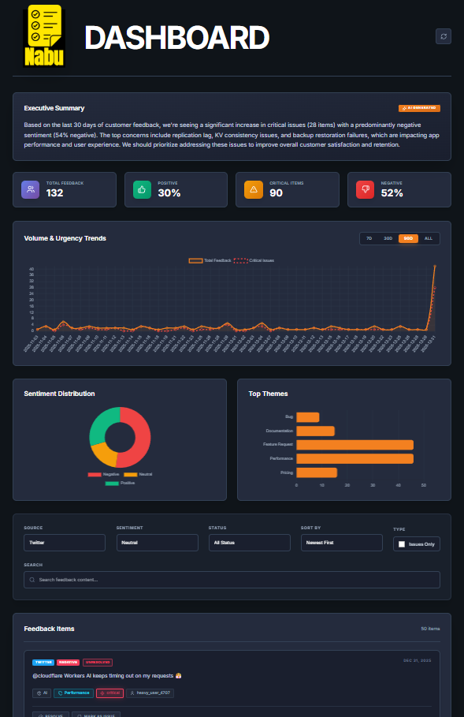

# Nabu - AI-Powered Feedback Intelligence

Nabu is a production-grade feedback aggregation and analysis platform built on Cloudflare's serverless stack. It unified customer feedback from Discord, GitHub, Twitter, and Support channels into a single, high-impact dashboard.

## Key Features

- **Unified Aggregation**: Real-time feedback collection from multiple sources.
- **AI Classification**: Automated sentiment, product, and urgency detection using `@cf/baai/bge-base-en-v1.5` embeddings.
- **Executive Summary**: LLM-generated insights (Llama 3.1 8B) with context-aware prioritization.
- **Dynamic Thresholding**: 50% confidence gating for critical issues to ensure precision.
- **Interactive Dashboard**: Logic-driven sorting (Importance vs. Date), theme distribution, and volume trends.

## Tech Stack

- **Runtime**: Cloudflare Workers
- **Database**: Cloudflare D1 (SQL)
- **AI/ML**: Cloudflare Workers AI (Embeddings & Llama 3.1)
- **Frontend**: Vanilla JS + Tailwind CSS (served via Cloudflare Assets)

## Project Structure

- `/nabu/nabu`: Core application code.
- `/nabu/nabu/src`: Worker logic, API routes, and AI services.
- `/nabu/nabu/public`: Dashboard UI and assets.
- `planning_and_arch.md`: Detailed architecture and user story mapping.
- `FRICTION_LOG.md`: Implementation challenges and developer experience notes.

## Getting Started

1. Navigate to `nabu/nabu`.
2. Install dependencies: `npm install`.
3. Deploy to Cloudflare: `npx wrangler deploy`.
4. Seed or classify: Access `/api/seed` or `/api/classify` endpoints.

## Documentation
For a deep dive into the architecture, see [planning_and_arch.md](./planning_and_arch.md).
To review the implementation journey, see [FRICTION_LOG.md](./FRICTION_LOG.md).
